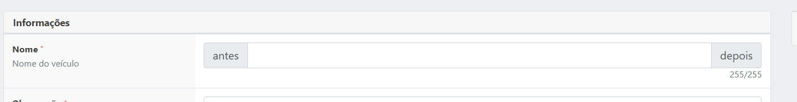
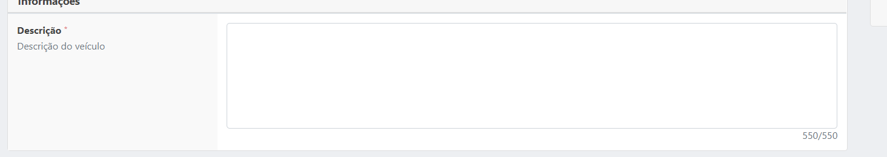
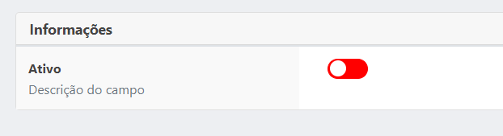
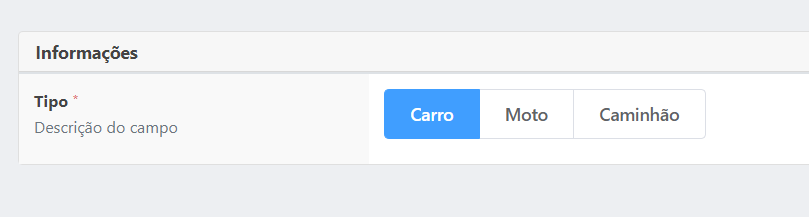
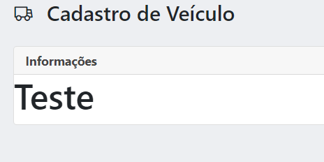
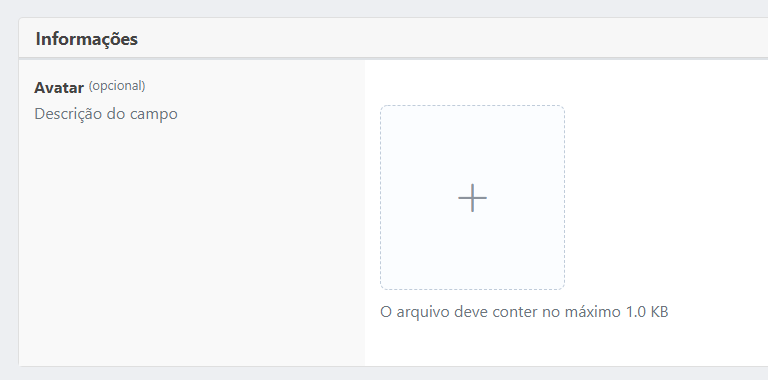
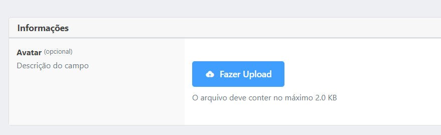

# Vstack Filters
Aqui apenas descreveremos as configurações mais aprofundadas de filtros, porém se deseja entender sobre a utilização 
[Leia mais sobre Resources](RESOURCES.md)

Vale lembrar que todos os campos abaixo exceto o card, possuem uma configuração chamada <b>default</b>, esse campo dará valor inicial ao input.

### Tipos de inputs 

### Card

Card de agrupamento de fields
```
use marcusvbda\vstack\Fields\Card;

...
new Card('Informações',$fields),
...
```



<br>
<br>

### Text
Input comum de texto/número, abaixo um exemplo de utilização :
```
use marcusvbda\vstack\Fields\Text;

...
new Text([
    "label" => "Nome", //obrigatório
    "type" => "text", //opcional, default 'text'
    "field" => "name", //obrigatório
    "description" => "Nome do veículo", //opcional
    "rules" => ["max:255", "required"], //opcional
    "prepend" => "depois", //opcional
    "append" => "antes", //opcional
    "mask" => ["##:##:##"], //opcional
    "visible" => true, //opcional, default true
    "show_value_length" => true //opcional, default false
]),
...
```


- <b>Label</b>, é como o campo será nomeado;
- <b>Type</b>, segue a nomenclatura de [type input do HTML5](https://www.w3schools.com/html/html_form_input_types.asp);
- <b>Field</b>, é o índice que o valor do campo será adicionado ao form_data;
- <b>Description</b>, descrição que aparecerá abaixo do nome do campo (label);
- <b>Rules</b>, rules de validação do laravel;
- <b>Append</b>, oque aparecerá no início do input;
- <b>Prepend</b>, oque aparecerá no fim do input;
- <b>Mask</b>, array de mascaras do [VueMask](https://www.npmjs.com/package/v-mask);
- <b>Visible</b>, define se o campo deve ser oculto ou não;
- <b>Show_value_length</b>, define se o contado de caracteres até o limite máximo deve aparecer ou não abaixo do input;

<br>
<br>

### Textarea
Input textarea comum, abaixo um exemplo de utilização :
```
use marcusvbda\vstack\Fields\TextArea;

...
new TextArea([
    "label" => "Descrição", //obrigatório
    "field" => "description", //obrigatório
    "rows" => 6, //opcional, default 3
    "description" => "Descrição do veículo", //opcional
    "rules" => ["max:550", "required"], //opcional
    "visible" => true, //opcional, default true
    "show_value_length" => true //opcional, default false
]),
...
```


- <b>Label</b>, é como o campo será nomeado;
- <b>Field</b>, é o índice que o valor do campo será adicionado ao form_data;
- <b>Rows</b>, define quantas linhas o input terá por padrão;
- <b>Description</b>, descrição que aparecerá abaixo do nome do campo (label);
- <b>Rules</b>, rules de validação do laravel;
- <b>Visible</b>, define se o campo deve ser oculto ou não;
- <b>Show_value_length</b>, define se o contado de caracteres até o limite máximo deve aparecer ou não abaixo do input;


<br>
<br>

### Checkbox
Input checkbox, abaixo um exemplo de utilização :
```
use marcusvbda\vstack\Fields\Check;

...
new Check([
    "label" => "Ativo", //obrigatório
    "field" => "enabled", //obrigatório
    "description" => "Descrição do campo", //obrigatório
]),
...
```


- <b>Label</b>, é como o campo será nomeado;
- <b>Field</b>, é o índice que o valor do campo será adicionado ao form_data;
- <b>Description</b>, descrição que aparecerá abaixo do nome do campo (label);


<br>
<br>

### Radio
Input radio, abaixo um exemplo de utilização :
```
use marcusvbda\vstack\Fields\Radio;

...
new Radio([
    "label" => "Tipo", //obrigatório
    "field" => "type", //obrigatório
    "description" => "Descrição do campo", //obrigatório
    // "options" => ["Carro", "Moto", "Caminhão"], //obrigatório
    "options" => [
        ["value" => "car", "label" => "Carro"],
        ["value" => "bike", "label" => "Moto"],
        ["value" => "truck", "label" => "Caminhão"],
    ], //obrigatório
    "rules" => ["required"]//opcional
]),
...
```


- <b>Label</b>, é como o campo será nomeado;
- <b>Field</b>, é o índice que o valor do campo será adicionado ao form_data;
- <b>Description</b>, descrição que aparecerá abaixo do nome do campo (label);
- <b>Options</b>, as opções que serão listadas ( pode ser listada das 2 formas apresentadas no exemplo );
- <b>Rules</b>, rules de validação do laravel;


<br>
<br>

### CustomComponent
HTML customizado, abaixo um exemplo de utilização :
```
use marcusvbda\vstack\Fields\CustomComponent;

...
new CustomComponent("<h1>Teste</h1>"),
...
```



<br>
<br>

### Upload
Input upload, abaixo um exemplo de utilização :
```
use marcusvbda\vstack\Fields\Upload;

...
new Upload([
    "label" => "Avatar", //obrigatório
    "field" => "photo", //obrigatório
    "description" => "Descrição do campo", //obrigatório
    "preview" => true, //opcional, default true
    "accept" => "image/*", //opcional, default "image/*"
    // "multiple" => false, //opcional, default false
    // "rules" => ["required"], //opcional
    // "upload_route" => "upload", //opcional, default Config("vstack.default_upload_route")
    "file_size_limit" => "1024", //opcional, default "2048"
    //"style" => "gallery", //opcional, default "gallery" ou "file"
])
...
```


- <b>Label</b>, é como o campo será nomeado;
- <b>Field</b>, é o índice que o valor do campo será adicionado ao form_data;
- <b>Description</b>, descrição que aparecerá abaixo do nome do campo (label);
- <b>Preview</b>, se ao clicado no link do input deve aparecer um preview de imagem;
- <b>Accept</b>, arquivos aceitos para o [input html 5](https://developer.mozilla.org/en-US/docs/Web/HTML/Attributes/accept);
- <b>Multiple</b>, se o input aceitar multiplos arquivos/imagens;
- <b>Rules</b>, rules de validação do laravel;
- <b>Upload_route</b>, rota que será feito upload, por padrão o sistema utilizará a rota vinda de Config("vstack.default_upload_route");
- <b>File_size_limit</b>, tamanho máximo aceito;
- <b>Style</b>, se o input aparecerá no modo galeria ou lista de arquivo (exemplo de cima é galeria, em baixo lista de arquivos);

