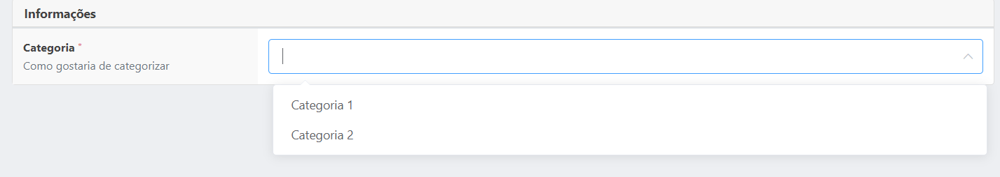
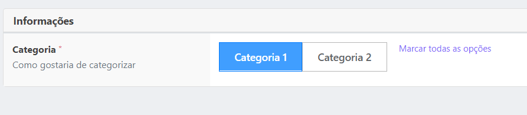
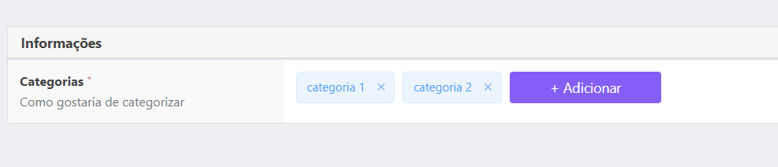
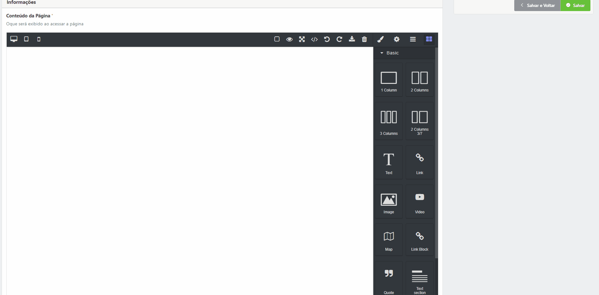

# Vstack Inputs
Aqui apenas descreveremos as configurações mais aprofundadas de inputs, porém se deseja entender sobre a utilização 
[Leia mais sobre Resources](RESOURCES.md)

Vale lembrar que todos os campos abaixo exceto o card, possuem algumas configurações em comum, são elas :
 - <b>default</b> (opcional), esse campo dará valor inicial ao input;
 - <b>description</b> (opcional), descrição que aparecerá abaixo do nome do campo (label);
 - <b>field</b> (obrigatório), é o índice que o valor do campo será adicionado ao form_data;
 - <b>custom_message</b> (opcional), define as mensagens customizadas para regras de validação do input;


 <br>
 <br>


### Tipos de inputs 

### Card

Card de agrupamento de fields
```
use marcusvbda\vstack\Fields\Card;

...
new Card('Informações',$fields),
...
```


<br>
<br>

### Text
Input comum de texto/número, abaixo um exemplo de utilização :
```
use marcusvbda\vstack\Fields\Text;

...
new Text([
    "label" => "Nome", //obrigatório
    "type" => "text", //opcional, default 'text'
    "field" => "name", //obrigatório
    "description" => "Nome do veículo", //opcional
    "prepend" => "depois", //opcional
    "append" => "antes", //opcional
    "mask" => ["##:##:##"], //opcional
    "visible" => true, //opcional, default true
    "show_value_length" => true, //opcional, default false
    "rules" => ["required"], //opcional, default []
    "custom_message" => ["required" => "Campo obrigatório."]  //opcional, default []
]),
...
```


- <b>Type</b>, segue a nomenclatura de [type input do HTML5](https://www.w3schools.com/html/html_form_input_types.asp);
- <b>append</b>, oque aparecerá no início do input;
- <b>prepend</b>, oque aparecerá no fim do input;
- <b>mask</b>, array de mascaras do [VueMask](https://www.npmjs.com/package/v-mask);
- <b>visible</b>, define se o campo deve ser oculto ou não;
- <b>show_value_length</b>, define se o contado de caracteres até o limite máximo deve aparecer ou não abaixo do input;

<br>
<br>

### Textarea
Input textarea comum, abaixo um exemplo de utilização :
```
use marcusvbda\vstack\Fields\TextArea;

...
new TextArea([
    "label" => "Descrição", //obrigatório
    "field" => "description", //obrigatório
    "rows" => 6, //opcional, default 3
    "description" => "Descrição do veículo", //opcional
    "visible" => true, //opcional, default true
    "show_value_length" => true, //opcional, default false
    "rules" => ["required"], //opcional, default []
    "custom_message" => ["required" => "Campo obrigatório."]  //opcional, default []
]),
...
```


- <b>rows</b>, define quantas linhas o input terá por padrão;
- <b>visible</b>, define se o campo deve ser oculto ou não;
- <b>show_value_length</b>, define se o contado de caracteres até o limite máximo deve aparecer ou não abaixo do input;


<br>
<br>

### Checkbox
Input checkbox, abaixo um exemplo de utilização :
```
use marcusvbda\vstack\Fields\Check;

...
new Check([
    "label" => "Ativo", //obrigatório
    "field" => "enabled", //obrigatório
    "description" => "Descrição do campo", //obrigatório
]),
...
```


- <b>field</b>, é o índice que o valor do campo será adicionado ao form_data;


<br>
<br>

### Radio
Input radio, abaixo um exemplo de utilização :
```
use marcusvbda\vstack\Fields\Radio;

...
new Radio([
    "label" => "Tipo", //obrigatório
    "field" => "type", //obrigatório
    "description" => "Descrição do campo", //obrigatório
    // "options" => ["Carro", "Moto", "Caminhão"], //obrigatório
    "options" => [
        ["value" => "car", "label" => "Carro"],
        ["value" => "bike", "label" => "Moto"],
        ["value" => "truck", "label" => "Caminhão"],
    ], //obrigatório
    "rules" => ["required"], //opcional, default []
    "custom_message" => ["required" => "Campo obrigatório."]  //opcional, default []
]),
...
```


- <b>options</b>, as opções que serão listadas ( pode ser listada das 2 formas apresentadas no exemplo );


<br>
<br>

### CustomComponent
HTML customizado, abaixo um exemplo de utilização :
```
use marcusvbda\vstack\Fields\CustomComponent;

...
new CustomComponent("<h1>Teste</h1>"),
...
```


<br>
<br>

### Upload
Input upload, abaixo um exemplo de utilização :
```
use marcusvbda\vstack\Fields\Upload;

...
new Upload([
    "label" => "Avatar", //obrigatório
    "field" => "photo", //obrigatório
    "description" => "Descrição do campo", //obrigatório
    "preview" => true, //opcional, default true
    "accept" => "image/*", //opcional, default "image/*"
    // "multiple" => false, //opcional, default false
    // "upload_route" => "upload", //opcional, default Config("vstack.default_upload_route")
    "file_size_limit" => "1024", //opcional, default "2048"
    //"style" => "gallery", //opcional, default "gallery" ou "file"
    "rules" => ["required"], //opcional, default []
    "custom_message" => ["required" => "Campo obrigatório."]  //opcional, default []
])
...
```


- <b>preview</b>, se ao clicado no link do input deve aparecer um preview de imagem;
- <b>accept</b>, arquivos aceitos para o [input html 5](https://developer.mozilla.org/en-US/docs/Web/HTML/Attributes/accept);
- <b>multiple</b>, se o input aceitar multiplos arquivos/imagens;
- <b>upload_route</b>, rota que será feito upload, por padrão o sistema utilizará a rota vinda de Config("vstack.default_upload_route");
- <b>file_size_limit</b>, tamanho máximo aceito;
- <b>style</b>, se o input aparecerá no modo galeria ou lista de arquivo (exemplo de cima é galeria, em baixo lista de arquivos);


<br>
<br>

### BelongsTo
Input Select, abaixo um exemplo de utilização :
```
use marcusvbda\vstack\Fields\BelongsTo;

...
new BelongsTo([
    "label" => "Categoria", //obrigatório
    "description" => "Como gostaria de categorizar",  //obrigatório
    "field" => "category_id",  //obrigatório
    "multiple" => false, // opcional, default false
    "model" => Category::class, 
    "model_fields" => ["id" => "id", "name" => "title"], // opcional, default  ["id" => "id", "name" => "name"]
    //"options" => [
    //    ["id" => 1, "value" => "Categoria 1"],
    //    ["id" => 2, "value" => "Categoria 2"],
    //],
    "rules" => ["required"], //opcional, default []
    "custom_message" => ["required" => "Campo obrigatório."]  //opcional, default []
]),
...
```


- <b>options</b>, as opções que serão listadas ( no caso de usar options, o carregamento é síncrono, sendo assim, caso as opções venham da base de dados é preciso fazer a busca e converter para array no padrão do exemplo );
- <b>model</b>, desta forma o carregamento das opções acontece de forma assíncrona, ou seja, via ajax pós carregamento da página ( ideal para opções vindas da base de dados );
- <b>model_fields</b> é um gabarito do model, o componente precisa de um id e um name, caso esses atributos na tabela sejam diferentes deste padrão deve-se definir no gabarito qual será o id e qual será o name da opção;


<br>
<br>

### Tags
Input Tags, abaixo um exemplo de utilização :
```
use marcusvbda\vstack\Fields\Tags;

...
new Tags([
    "label" => "Categorias", //obrigatório
    "description" => "Como gostaria de categorizar",  //opcional
    "field" => "category_id",  //obrigatório
    "rules" => ["required"], //opcional, default []
    "custom_message" => ["required" => "Campo obrigatório."]  //opcional, default []
])
...
```



<br>
<br>

### HtmlEditor
Input HtmlEditor, abaixo um exemplo de utilização :
```
use marcusvbda\vstack\Fields\HtmlEditor;

...
new HtmlEditor([
    "label" => "Conteúdo da Página",  //obrigatório
    "field" => "body", //obrigatório
    //"mode" => "webpage", //opcional, default webpage, pode ser newsletter
    "description" => "Oque será exibido ao acessar a página",
    //"blocks" => [
    //    "hello_world_test" => [
    //        "label"  => "Hello World",
    //        "attributes" =>  [
    //            "class" => "class-test"
    //        ],
    //        "content" =>  "<h1>Hello World TESTE</h1>"
    //    ]
    //], //opcional, default [], adiciona custom blocks no editor
    "rules" => ["required"], //opcional, default []
    "custom_message" => ["required" => "Campo obrigatório."]  //opcional, default []
]),
...
```

- <b>blocks</b>, array de objetos com os atributos, label, attributes e content (html), que adicionará ao editor um bloco com as características definidas;

